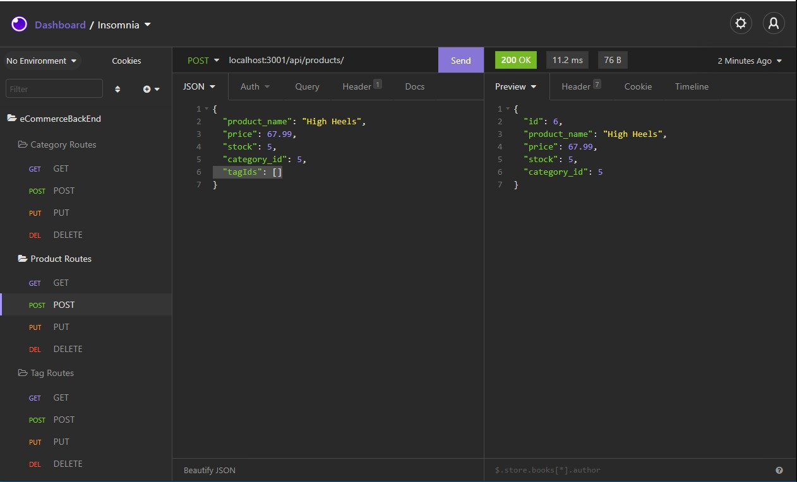

# eCommerceBackEnd
Without a back end, life would be pretty flat.

[Link to video.](https://drive.google.com/file/d/1QPva6Y1kY3c58vIYIkdBNUpjHHhY30qp/view?usp=sharing)

## Description
- Originally this program was missing its back end. 
- Using dotenv, express, mysql2, and sequelize, I fixed this problem by creating a robust database that properly Creates, Reads, Updates, and Deletes data in the various data tables. 
- Additionally, the data base now syncs and connects to the server, so it can be accessed by any frontend.
- I learned a lot about usingn sequelize to create and manage databases, as well as how to properly connect them to a server.

## Table of Contents
- [eCommerceBackEnd](#ecommercebackend)
  - [Description](#description)
  - [Table of Contents](#table-of-contents)
  - [Installation](#installation)
  - [Usage](#usage)
  - [Credits](#credits)
  - [License](#license)
  - [Contributing](#contributing)
  - [Tests](#tests)
  - [Contact](#contact)

## Installation
1. Provided that you have a code editor of your choosing installed on your system, such as VS Code (https://code.visualstudio.com/),

2. Provided that you have a Terminal installed for Windows (https://www.microsoft.com/en-us/p/windows-terminal/9n0dx20hk701?rtc=1&activetab=pivot:overviewtab) or are using a Mac with Terminal installed with the OS,

3. Provided that you have npm and Node.js installed for windows (https://www.npmjs.com/get-npm),

4. Provided you have Git and Github Desktop installed (https://git-scm.com/downloads, https://desktop.github.com/) and have registered for an account,

5. Provided you have MySQL and MySQL workbench installed (https://www.mysql.com/downloads/),

6. Provided you have Insomnia downloaded and installed (https://insomnia.rest/download),

7. Either Clone or Fork this repository: (https://github.com/mmonyok/eCommerceBackEnd.git),

8. After cloning the repository to your local computer, initialize npm, as well as install dotenv, express, mysql2, and sequelize node modules. 

## Usage
- First, go into your MySQL shell and create the database with the command CREATE DATABASE {database name}; then run the command USE {database name}; to make sure it is the database in use.
- Then, within VS Code terminal, initialize npm and then install your node modules (dotenv, express, mysql2, and sequelize).
- Afterwards, create a .env file in the root folder and add your database name, user, and password to it in matching format to ./confic/connection.js.
- Next, seed your database by executing the command, npm run seed.
- Finally, start your server by using the command npm start.
- You can now use insomnia to edit your database as desired.

## Credits

- Technologies Used:
  - [JavaScript](https://www.w3schools.com/js/)
  - [ScreenToGIF](https://www.screentogif.com/)
  - [Node.js](https://www.npmjs.com/get-npm)
  - [NPM](https://www.npmjs.com/get-npm)
  - [Express.js](https://expressjs.com/)
  - [mysql2 Node Module](https://www.npmjs.com/package/mysql2)
  - [dotenv Node Module](https://www.npmjs.com/package/dotenv)
  - [sequelize Node Module](https://www.npmjs.com/package/sequelize)
  - [Insomnia](https://insomnia.rest/download)

- Tutorials Followed:
[Professional README guide template provided by Coding Boot Camp.](https://github.com/coding-boot-camp)

- Additional Assets:
[Color palette taken from colorhunt.co; it is color palette #264587.](https://colorhunt.co/palette/282007)

[Text Art Generated by patorjk.](https://patorjk.com/software/taag/#p=display&f=Graffiti&t=Type%20Something%20)

## License
MIT License

Copyright (c) [2021] [Melody Monyok]

Permission is hereby granted, free of charge, to any person obtaining a copy
of this software and associated documentation files (the "Software"), to deal
in the Software without restriction, including without limitation the rights
to use, copy, modify, merge, publish, distribute, sublicense, and/or sell
copies of the Software, and to permit persons to whom the Software is
furnished to do so, subject to the following conditions:

The above copyright notice and this permission notice shall be included in all
copies or substantial portions of the Software.

THE SOFTWARE IS PROVIDED "AS IS", WITHOUT WARRANTY OF ANY KIND, EXPRESS OR
IMPLIED, INCLUDING BUT NOT LIMITED TO THE WARRANTIES OF MERCHANTABILITY,
FITNESS FOR A PARTICULAR PURPOSE AND NONINFRINGEMENT. IN NO EVENT SHALL THE
AUTHORS OR COPYRIGHT HOLDERS BE LIABLE FOR ANY CLAIM, DAMAGES OR OTHER
LIABILITY, WHETHER IN AN ACTION OF CONTRACT, TORT OR OTHERWISE, ARISING FROM,
OUT OF OR IN CONNECTION WITH THE SOFTWARE OR THE USE OR OTHER DEALINGS IN THE
SOFTWARE.

## Contributing
- Please submit any contributions you think will improve this project.

## Tests
- No further testing is needed, unless any new contributions are made; the owner of this project will locally test any contribution submissions prior to approval.

## Contact
- Melody Monyok
  - <monyokwebdev@gmail.com>
  - (612) 492-1528